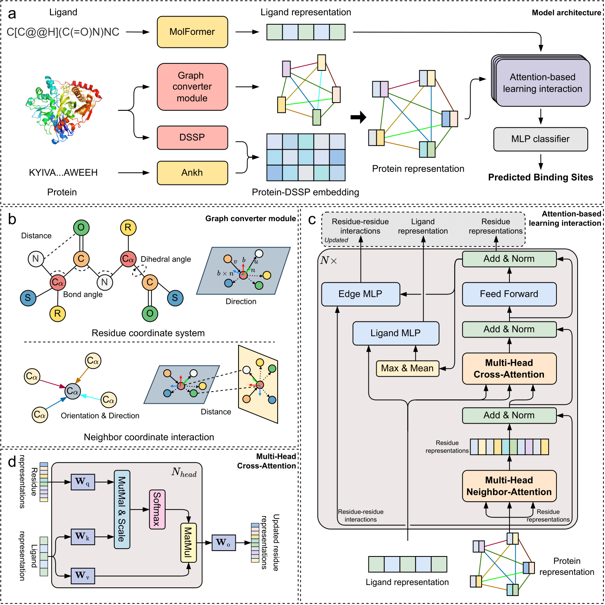

# LABind: Identifying Protein Binding Ligand-Aware Sites via Learning Interactions Between Ligand and Protein

## Introduction
LABind is a novel structure-based method to predict the binding sites of proteins with all ions and small molecules in a ligand-aware manner.


## Preparation
Clone this repository by `git clone https://github.com/ljquanlab/LABind.git` or download the code in ZIP archive.

LABind primarily relies on the following Python packages:
- python=3.8.19
- cuda=11.8
- torch=2.1.1
- biopython=1.83
- transformers=4.39.3
- scikit-learn=1.3.2
- panydas=2.0.3
- numpy=1.24.3
- scipy=1.10.1
- tqdm=4.66.2
- lxml=5.2.1
- periodictable=1.7.0
- accelerate=0.30.1

In case you want to use conda for your own installation please create a new LABind environment.
We showed an example of creating an environment.
```sh
conda create -n LABind python=3.8.19
conda activate LABind
conda install pytorch==2.1.1 pytorch-cuda=11.8 -c pytorch -c nvidia
conda install biopython=1.83 transformers=4.39.3 scikit-learn=1.3.2 pandas=2.0.3 numpy=1.24.3 scipy=1.10.1 -c conda-forge
pip install lxml==5.2.1 periodictable==1.7.0 accelerate==0.30.1
```

Or you can use the provided [environment.yml](./environment.yml) to create all the required dependency packages.
```sh
conda env create -f environment.yml
```

It is also necessary to install three pre-trained models: [ESMFold_v1](https://huggingface.co/facebook/esmfold_v1), [Ankh-large](https://huggingface.co/ElnaggarLab/ankh-large), and [MolFormer-XL-both-10pct](https://huggingface.co/ibm/MoLFormer-XL-both-10pct). We use the pre-trained weights from HuggingFace for prediction. Please download them to your device and modify the corresponding paths in `scripts/config.py`.

Then add permission to execute for DSSP and MSMS by `chmod +x ./tools/mkdssp ./tools/msms`

## Usage
### Validation
Checkpoints trained on the DS3 dataset are provided in `./model/Unseen/`. If you need to validate our results, you can modify the checkpoint used by LABind in the `./scripts/config.py`.
We have uploaded all the data files and checkpoints to [Zenodo](https://doi.org/10.5281/zenodo.13938443).
### Prediction
We provide examples in `./example`. First, you must provide a FASTA file. If `smiles.txt` is not available, LABind will automatically retrieve it, so please ensure your device can connect to the RCSB database.

An example of a FASTA file is shown below:
```fasta
>8iw5B ZN
SLRALHLVEDLRGLLEMMETDEKEGLRCQIPDSTAEVLIEWLQN
>8oerI CA
CVREVCRWSSWYNGHRPEPGLGGGDFETFENLRQRGYQVCPVLADIECRAAQLPDMPLEELGQQVDCDRMRGLMCANSQQSPPLCHDYELRVLCCEYVPC
>5ldpA ATP
SEPQRLFFAIDLPAEIREQIIHWRAKHFPPEAGRPVAADNLHLTLAFLGEVSAEKEKALSLLAGRIRQPGFTLTLDDAGQWLRSRVVWLGMRQPPRGLIQLANMLRSQAARSGCFQSNRPFHPHITLLRDASEAVTIPPPGFNWSYAVTEFTLYASSFARGRTRYTPLKRWALTQ
>8ppzB 0AN
MDPEFMEMWHEGLEEASRLYFGERNVKGMFEVLEPLHAMMERGPQTLKETSFNQAYGRDLMEAQEWCRKYMKSGNVKDLTQAWDLYYHVFRRIS
```
> Please make sure to use the same format as the example. Deviations may result in unexpected errors or issues during processing.

Then run:
```bash
cd scripts/
python prediction.py -op ../example/out/ -if ../example/protein.fa -ip ../example/pdb/ -il ../example/smiles.txt
```
And the prediction results will be saved in `./example/out/RESULT.csv`. 

Other parameters:
```
-b  BATCH           Batch size for LABind prediction, default=1
-g  GPU_LIST        Gpu list for LABind prediction, default=0
```
> For instance, `-b 4 -g 0 1`

### Retrain
If you need to retrain the model, you can try modifying `./scripts/wandb.py` for training, which requires installing the wandb package. `pip install wandb`

## Contacts
Any more questions, please do not hesitate to contact us: zjzhang21@stu.suda.edu.cn and ljquan@suda.edu.cn.

## License
This project is licensed under the terms of the MIT license. See [LICENSE](./LICENSE) for additional details.
